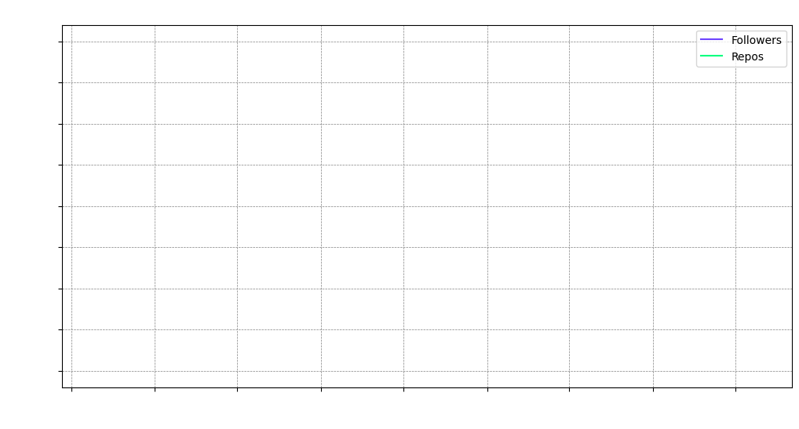
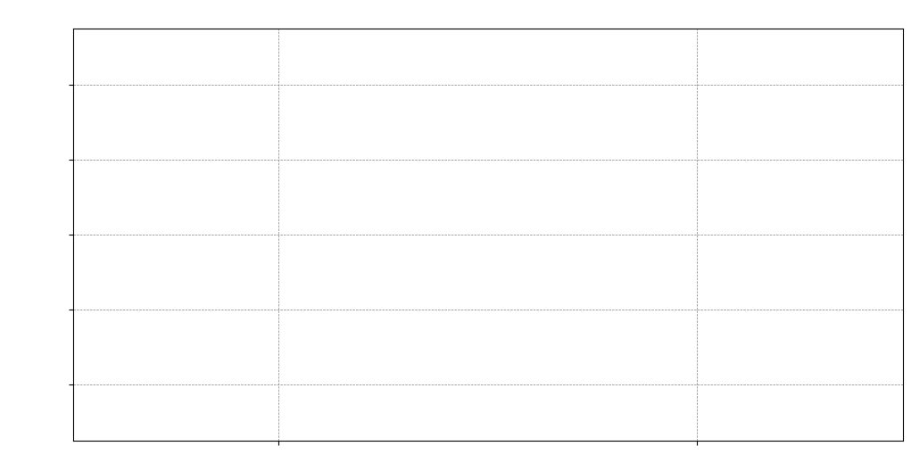
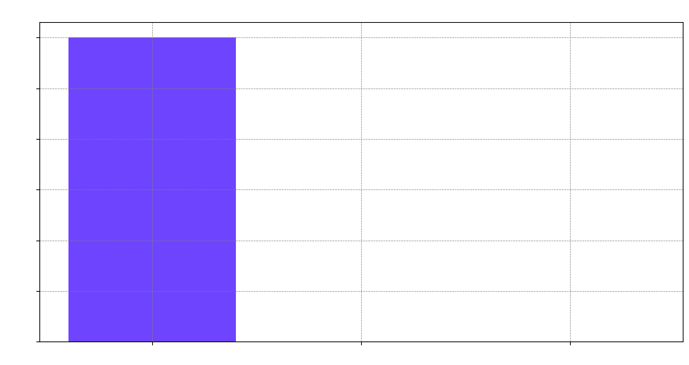
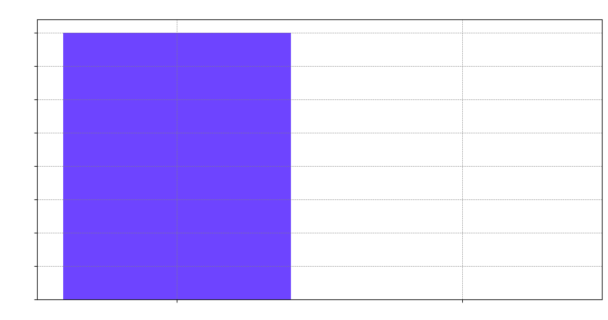
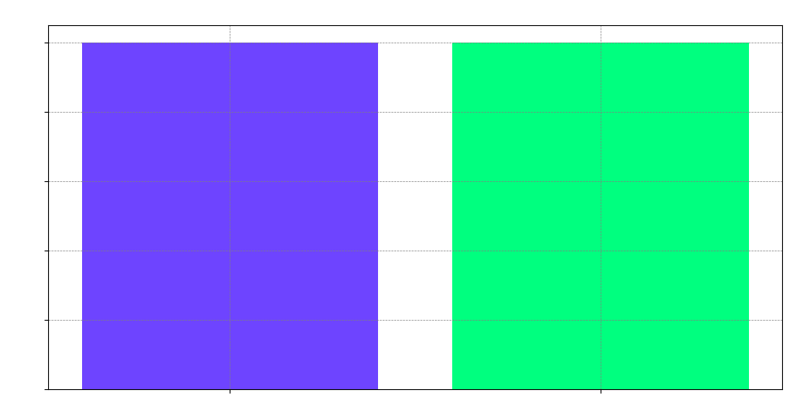

# Hi there, I'm [Zettalynx](https://github.com/Zettalynx) 👋

Welcome to my GitHub profile! Here you'll find various interactive elements and visualizations of my GitHub activity and contributions.

### GitHub Followers vs. Repositories

### Pull Requests vs. Issues

### Commits vs. Code Frequency

### Contributors vs. Forks

### Stars vs. Watchers

<!--
**Zettalynx/Zettalynx** is a ✨ _special_ ✨ repository because its `README.md` (this file) appears on your GitHub profile.

Here are some ideas to get you started:

- 🔭 I’m currently working on ...
- 🌱 I’m currently learning ...
- 👯 I’m looking to collaborate on ...
- 🤔 I’m looking for help with ...
- 💬 Ask me about ...
- 📫 How to reach me: ...
- 😄 Pronouns: ...
- ⚡ Fun fact: ...
-->
