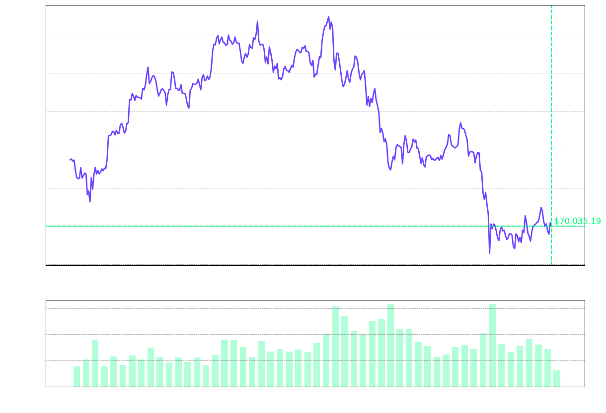

# Hi there, I'm [Zettalynx](https://github.com/Zettalynx) 👋

Welcome to my GitHub profile! Here you'll find various interactive elements and visualizations of Crypto price.

### Bitcoin Price (Last 1 Year)

### Coins

<!--START_SECTION:coins-->

<table style="width: 100%; border-collapse: collapse; color: white;">
  <tr>
    <th style="border: 1px solid white; padding: 10px;">#</th>
    <th style="border: 1px solid white; padding: 10px;">Coin</th>
    <th style="border: 1px solid white; padding: 10px;">Current Price (USD)</th>
    <th style="border: 1px solid white; padding: 10px;">Market Cap (USD)</th>
    <th style="border: 1px solid white; padding: 10px;">24h Volume (USD)</th>
  </tr>
  <tr>
    <td style="border: 1px solid white; padding: 10px;">1</td>
    <td style="border: 1px solid white; padding: 10px;"> Bitcoin (BTC)</td>
    <td style="border: 1px solid white; padding: 10px;">$95,680.00</td>
    <td style="border: 1px solid white; padding: 10px;">$1,897,259,061,878.00</td>
    <td style="border: 1px solid white; padding: 10px;">$12,576,916,034.00</td>
  </tr>
  <tr>
    <td style="border: 1px solid white; padding: 10px;">2</td>
    <td style="border: 1px solid white; padding: 10px;"> Ethereum (ETH)</td>
    <td style="border: 1px solid white; padding: 10px;">$2,801.12</td>
    <td style="border: 1px solid white; padding: 10px;">$337,754,403,196.00</td>
    <td style="border: 1px solid white; padding: 10px;">$19,227,568,190.00</td>
  </tr>
  <tr>
    <td style="border: 1px solid white; padding: 10px;">3</td>
    <td style="border: 1px solid white; padding: 10px;"> XRP (XRP)</td>
    <td style="border: 1px solid white; padding: 10px;">$2.56</td>
    <td style="border: 1px solid white; padding: 10px;">$148,302,976,194.00</td>
    <td style="border: 1px solid white; padding: 10px;">$1,971,092,631.00</td>
  </tr>
  <tr>
    <td style="border: 1px solid white; padding: 10px;">4</td>
    <td style="border: 1px solid white; padding: 10px;"> Tether (USDT)</td>
    <td style="border: 1px solid white; padding: 10px;">$1.00</td>
    <td style="border: 1px solid white; padding: 10px;">$142,501,229,631.00</td>
    <td style="border: 1px solid white; padding: 10px;">$23,241,470,465.00</td>
  </tr>
  <tr>
    <td style="border: 1px solid white; padding: 10px;">5</td>
    <td style="border: 1px solid white; padding: 10px;"> BNB (BNB)</td>
    <td style="border: 1px solid white; padding: 10px;">$653.56</td>
    <td style="border: 1px solid white; padding: 10px;">$95,336,504,208.00</td>
    <td style="border: 1px solid white; padding: 10px;">$573,432,256.00</td>
  </tr>
  <tr>
    <td style="border: 1px solid white; padding: 10px;">6</td>
    <td style="border: 1px solid white; padding: 10px;"> Solana (SOL)</td>
    <td style="border: 1px solid white; padding: 10px;">$167.51</td>
    <td style="border: 1px solid white; padding: 10px;">$81,849,043,213.00</td>
    <td style="border: 1px solid white; padding: 10px;">$1,790,362,116.00</td>
  </tr>
  <tr>
    <td style="border: 1px solid white; padding: 10px;">7</td>
    <td style="border: 1px solid white; padding: 10px;"> USDC (USDC)</td>
    <td style="border: 1px solid white; padding: 10px;">$1.00</td>
    <td style="border: 1px solid white; padding: 10px;">$57,080,581,720.00</td>
    <td style="border: 1px solid white; padding: 10px;">$5,832,423,515.00</td>
  </tr>
  <tr>
    <td style="border: 1px solid white; padding: 10px;">8</td>
    <td style="border: 1px solid white; padding: 10px;"> Dogecoin (DOGE)</td>
    <td style="border: 1px solid white; padding: 10px;">$0.24</td>
    <td style="border: 1px solid white; padding: 10px;">$35,754,257,261.00</td>
    <td style="border: 1px solid white; padding: 10px;">$672,417,332.00</td>
  </tr>
  <tr>
    <td style="border: 1px solid white; padding: 10px;">9</td>
    <td style="border: 1px solid white; padding: 10px;"> Cardano (ADA)</td>
    <td style="border: 1px solid white; padding: 10px;">$0.77</td>
    <td style="border: 1px solid white; padding: 10px;">$27,539,182,509.00</td>
    <td style="border: 1px solid white; padding: 10px;">$461,559,117.00</td>
  </tr>
  <tr>
    <td style="border: 1px solid white; padding: 10px;">10</td>
    <td style="border: 1px solid white; padding: 10px;"> Lido Staked Ether (STETH)</td>
    <td style="border: 1px solid white; padding: 10px;">$2,795.01</td>
    <td style="border: 1px solid white; padding: 10px;">$26,315,413,078.00</td>
    <td style="border: 1px solid white; padding: 10px;">$29,368,017.00</td>
  </tr>
</table>

<!--END_SECTION:coins-->

<!--
**Zettalynx/Zettalynx** is a ✨ _special_ ✨ repository because its `README.md` (this file) appears on your GitHub profile.

Here are some ideas to get you started:

- 🔭 I’m currently working on ...
- 🌱 I’m currently learning ...
- 👯 I’m looking to collaborate on ...
- 🤔 I’m looking for help with ...
- 💬 Ask me about ...
- 📫 How to reach me: ...
- 😄 Pronouns: ...
- ⚡ Fun fact: ...
-->
