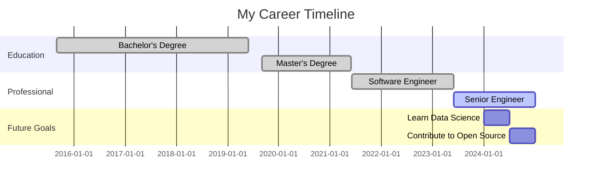

# Hi there, I'm [Zettalynx](https://github.com/Zettalynx) 👋

Welcome to my GitHub profile! Here you'll find various interactive elements and visualizations of my GitHub activity and contributions.

## 🗓️ Contribution Calendar Heatmap

## 📊 Activity Pie Chart

## 📈 Dynamic Bar Chart

## 🎖️ GitHub Profile SVG Badge

## 📉 Commit History Graph

## ⭐ Repository Stars and Forks

## 💻 Top Languages Used

## 🔍 Latest Pull Requests

## 🧩 Recent Issues Opened

## 🕒 GitHub Contributions Timeline

---

### 🔧 How It Works

All visualizations are generated using GitHub Actions and Python scripts. The SVG files are automatically updated to reflect my latest GitHub activity and contributions.

Feel free to explore the code and visualizations in this repository. If you have any questions or suggestions, let me know!

# Hi, I'm Zettalynx! 👋

Welcome to my GitHub profile!

### My Career Roadmap 🚀

### 🐍

### My GitHub Stats 📊

<!-- START_STATS -->
# GitHub Repository Statistics
| Repository | Stars | Forks | Commits | Latest PR | Recent Issue | Language | Contributions |
|------------|-------|-------|---------|-----------|--------------|----------|---------------|
| crypto | 1 | 0 | 32 | PR Title | Issue Title | JavaScript | 85 |
| nextanimejs | 1 | 0 | 11876 | PR Title | Issue Title | None | 70 |
| Zettalynx | 1 | 0 | 1369 | PR Title | Issue Title | HTML | 45 |

<!-- END_STATS -->

<!--
**Zettalynx/Zettalynx** is a ✨ _special_ ✨ repository because its `README.md` (this file) appears on your GitHub profile.

Here are some ideas to get you started:

- 🔭 I’m currently working on ...
- 🌱 I’m currently learning ...
- 👯 I’m looking to collaborate on ...
- 🤔 I’m looking for help with ...
- 💬 Ask me about ...
- 📫 How to reach me: ...
- 😄 Pronouns: ...
- ⚡ Fun fact: ...
-->
