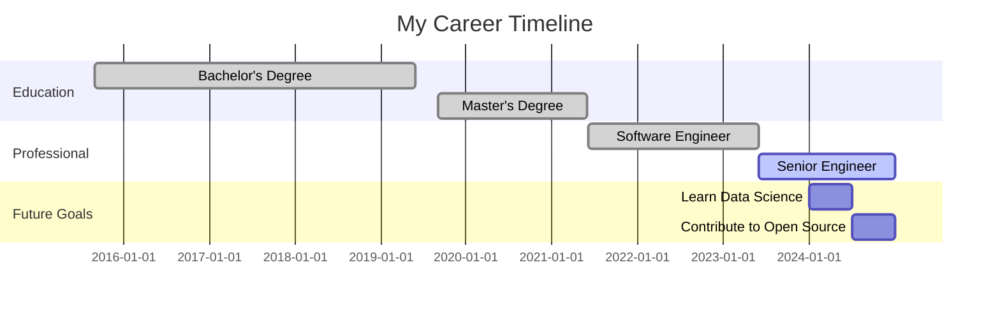

# Hi, I'm Zettalynx! 👋

Welcome to my GitHub profile!

# Welcome to My Profile!

## My Career Roadmap 🚀

## Recent Activity
<!--START_SECTION:activity-->
$(cat activity.md)
<!--END_SECTION:activity-->

### 🐍

### My GitHub Stats 📊

### Real-time Language Stats

### Code Trivia Challenge 🎮

[Click here to play the game!](https://Zettalynx.github.io/Zettalynx/index.html)

<!--
**Zettalynx/Zettalynx** is a ✨ _special_ ✨ repository because its `README.md` (this file) appears on your GitHub profile.

Here are some ideas to get you started:

- 🔭 I’m currently working on ...
- 🌱 I’m currently learning ...
- 👯 I’m looking to collaborate on ...
- 🤔 I’m looking for help with ...
- 💬 Ask me about ...
- 📫 How to reach me: ...
- 😄 Pronouns: ...
- ⚡ Fun fact: ...
-->
