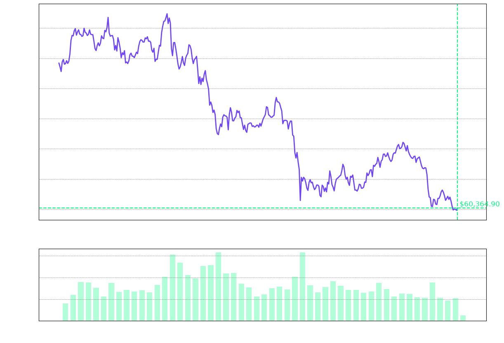

# Hi there, I'm [Zettalynx](https://github.com/Zettalynx) 👋

Welcome to my GitHub profile! Here you'll find various interactive elements and visualizations of Crypto price.

### Bitcoin Price (Last 1 Year)

### Coins

<!--START_SECTION:coins-->

<table style="width: 100%; border-collapse: collapse; color: white;">
  <tr>
    <th style="border: 1px solid white; padding: 10px;">#</th>
    <th style="border: 1px solid white; padding: 10px;">Coin</th>
    <th style="border: 1px solid white; padding: 10px;">Current Price (USD)</th>
    <th style="border: 1px solid white; padding: 10px;">Market Cap (USD)</th>
    <th style="border: 1px solid white; padding: 10px;">24h Volume (USD)</th>
  </tr>
  <tr>
    <td style="border: 1px solid white; padding: 10px;">1</td>
    <td style="border: 1px solid white; padding: 10px;"> Bitcoin (BTC)</td>
    <td style="border: 1px solid white; padding: 10px;">$73,293.00</td>
    <td style="border: 1px solid white; padding: 10px;">$1,465,850,026,298.00</td>
    <td style="border: 1px solid white; padding: 10px;">$46,792,800,180.00</td>
  </tr>
  <tr>
    <td style="border: 1px solid white; padding: 10px;">2</td>
    <td style="border: 1px solid white; padding: 10px;"> Ethereum (ETH)</td>
    <td style="border: 1px solid white; padding: 10px;">$2,263.37</td>
    <td style="border: 1px solid white; padding: 10px;">$272,978,838,071.00</td>
    <td style="border: 1px solid white; padding: 10px;">$18,332,505,717.00</td>
  </tr>
  <tr>
    <td style="border: 1px solid white; padding: 10px;">3</td>
    <td style="border: 1px solid white; padding: 10px;"> Tether (USDT)</td>
    <td style="border: 1px solid white; padding: 10px;">$1.00</td>
    <td style="border: 1px solid white; padding: 10px;">$184,494,926,630.00</td>
    <td style="border: 1px solid white; padding: 10px;">$69,300,781,519.00</td>
  </tr>
  <tr>
    <td style="border: 1px solid white; padding: 10px;">4</td>
    <td style="border: 1px solid white; padding: 10px;"> XRP (XRP)</td>
    <td style="border: 1px solid white; padding: 10px;">$1.35</td>
    <td style="border: 1px solid white; padding: 10px;">$83,004,280,784.00</td>
    <td style="border: 1px solid white; padding: 10px;">$2,292,481,102.00</td>
  </tr>
  <tr>
    <td style="border: 1px solid white; padding: 10px;">5</td>
    <td style="border: 1px solid white; padding: 10px;"> BNB (BNB)</td>
    <td style="border: 1px solid white; padding: 10px;">$608.61</td>
    <td style="border: 1px solid white; padding: 10px;">$82,984,399,654.00</td>
    <td style="border: 1px solid white; padding: 10px;">$1,119,336,070.00</td>
  </tr>
  <tr>
    <td style="border: 1px solid white; padding: 10px;">6</td>
    <td style="border: 1px solid white; padding: 10px;"> USDC (USDC)</td>
    <td style="border: 1px solid white; padding: 10px;">$1.00</td>
    <td style="border: 1px solid white; padding: 10px;">$78,754,282,237.00</td>
    <td style="border: 1px solid white; padding: 10px;">$15,203,474,755.00</td>
  </tr>
  <tr>
    <td style="border: 1px solid white; padding: 10px;">7</td>
    <td style="border: 1px solid white; padding: 10px;"> Solana (SOL)</td>
    <td style="border: 1px solid white; padding: 10px;">$84.03</td>
    <td style="border: 1px solid white; padding: 10px;">$48,328,729,883.00</td>
    <td style="border: 1px solid white; padding: 10px;">$3,567,109,053.00</td>
  </tr>
  <tr>
    <td style="border: 1px solid white; padding: 10px;">8</td>
    <td style="border: 1px solid white; padding: 10px;"> TRON (TRX)</td>
    <td style="border: 1px solid white; padding: 10px;">$0.32</td>
    <td style="border: 1px solid white; padding: 10px;">$30,410,160,528.00</td>
    <td style="border: 1px solid white; padding: 10px;">$505,389,966.00</td>
  </tr>
  <tr>
    <td style="border: 1px solid white; padding: 10px;">9</td>
    <td style="border: 1px solid white; padding: 10px;"> Figure Heloc (FIGR_HELOC)</td>
    <td style="border: 1px solid white; padding: 10px;">$1.03</td>
    <td style="border: 1px solid white; padding: 10px;">$17,091,614,828.00</td>
    <td style="border: 1px solid white; padding: 10px;">$14,802,046.00</td>
  </tr>
  <tr>
    <td style="border: 1px solid white; padding: 10px;">10</td>
    <td style="border: 1px solid white; padding: 10px;"> Dogecoin (DOGE)</td>
    <td style="border: 1px solid white; padding: 10px;">$0.09</td>
    <td style="border: 1px solid white; padding: 10px;">$14,266,603,314.00</td>
    <td style="border: 1px solid white; padding: 10px;">$1,190,062,746.00</td>
  </tr>
</table>

<!--END_SECTION:coins-->

<!--
**Zettalynx/Zettalynx** is a ✨ _special_ ✨ repository because its `README.md` (this file) appears on your GitHub profile.

Here are some ideas to get you started:

- 🔭 I’m currently working on ...
- 🌱 I’m currently learning ...
- 👯 I’m looking to collaborate on ...
- 🤔 I’m looking for help with ...
- 💬 Ask me about ...
- 📫 How to reach me: ...
- 😄 Pronouns: ...
- ⚡ Fun fact: ...
-->
