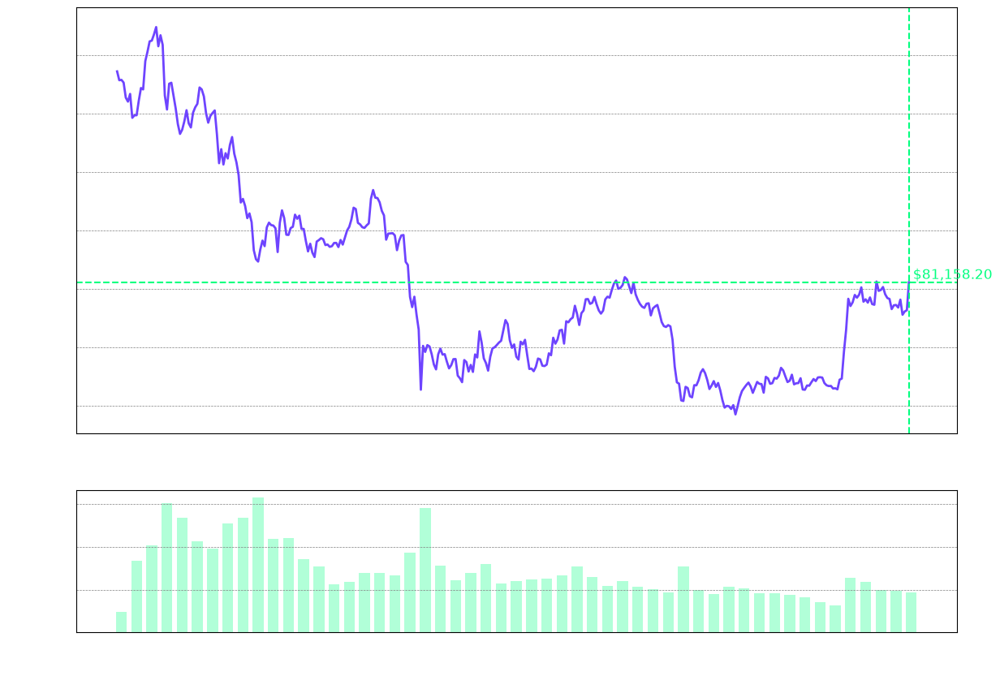

# Hi there, I'm [Zettalynx](https://github.com/Zettalynx) 👋

Welcome to my GitHub profile! Here you'll find various interactive elements and visualizations of Crypto price.

### Bitcoin Price (Last 1 Year)

### Coins

<!--START_SECTION:coins-->

<table style="width: 100%; border-collapse: collapse; color: white;">
  <tr>
    <th style="border: 1px solid white; padding: 10px;">#</th>
    <th style="border: 1px solid white; padding: 10px;">Coin</th>
    <th style="border: 1px solid white; padding: 10px;">Current Price (USD)</th>
    <th style="border: 1px solid white; padding: 10px;">Market Cap (USD)</th>
    <th style="border: 1px solid white; padding: 10px;">24h Volume (USD)</th>
  </tr>
  <tr>
    <td style="border: 1px solid white; padding: 10px;">1</td>
    <td style="border: 1px solid white; padding: 10px;"> Bitcoin (BTC)</td>
    <td style="border: 1px solid white; padding: 10px;">$64,550.00</td>
    <td style="border: 1px solid white; padding: 10px;">$1,295,749,821,962.00</td>
    <td style="border: 1px solid white; padding: 10px;">$18,493,687,332.00</td>
  </tr>
  <tr>
    <td style="border: 1px solid white; padding: 10px;">2</td>
    <td style="border: 1px solid white; padding: 10px;"> Ethereum (ETH)</td>
    <td style="border: 1px solid white; padding: 10px;">$1,911.14</td>
    <td style="border: 1px solid white; padding: 10px;">$230,683,828,146.00</td>
    <td style="border: 1px solid white; padding: 10px;">$6,081,680,276.00</td>
  </tr>
  <tr>
    <td style="border: 1px solid white; padding: 10px;">3</td>
    <td style="border: 1px solid white; padding: 10px;"> Tether (USDT)</td>
    <td style="border: 1px solid white; padding: 10px;">$1.00</td>
    <td style="border: 1px solid white; padding: 10px;">$183,023,385,964.00</td>
    <td style="border: 1px solid white; padding: 10px;">$30,110,425,498.00</td>
  </tr>
  <tr>
    <td style="border: 1px solid white; padding: 10px;">4</td>
    <td style="border: 1px solid white; padding: 10px;"> BNB (BNB)</td>
    <td style="border: 1px solid white; padding: 10px;">$602.29</td>
    <td style="border: 1px solid white; padding: 10px;">$80,209,365,065.00</td>
    <td style="border: 1px solid white; padding: 10px;">$496,121,561.00</td>
  </tr>
  <tr>
    <td style="border: 1px solid white; padding: 10px;">5</td>
    <td style="border: 1px solid white; padding: 10px;"> USDC (USDC)</td>
    <td style="border: 1px solid white; padding: 10px;">$1.00</td>
    <td style="border: 1px solid white; padding: 10px;">$71,834,737,089.00</td>
    <td style="border: 1px solid white; padding: 10px;">$7,905,510,364.00</td>
  </tr>
  <tr>
    <td style="border: 1px solid white; padding: 10px;">6</td>
    <td style="border: 1px solid white; padding: 10px;"> XRP (XRP)</td>
    <td style="border: 1px solid white; padding: 10px;">$1.00</td>
    <td style="border: 1px solid white; padding: 10px;">$62,691,186,399.00</td>
    <td style="border: 1px solid white; padding: 10px;">$810,982,821.00</td>
  </tr>
  <tr>
    <td style="border: 1px solid white; padding: 10px;">7</td>
    <td style="border: 1px solid white; padding: 10px;"> Solana (SOL)</td>
    <td style="border: 1px solid white; padding: 10px;">$76.91</td>
    <td style="border: 1px solid white; padding: 10px;">$44,838,157,139.00</td>
    <td style="border: 1px solid white; padding: 10px;">$1,397,175,801.00</td>
  </tr>
  <tr>
    <td style="border: 1px solid white; padding: 10px;">8</td>
    <td style="border: 1px solid white; padding: 10px;"> TRON (TRX)</td>
    <td style="border: 1px solid white; padding: 10px;">$0.33</td>
    <td style="border: 1px solid white; padding: 10px;">$31,584,492,603.00</td>
    <td style="border: 1px solid white; padding: 10px;">$369,792,193.00</td>
  </tr>
  <tr>
    <td style="border: 1px solid white; padding: 10px;">9</td>
    <td style="border: 1px solid white; padding: 10px;"> Figure Heloc (FIGR_HELOC)</td>
    <td style="border: 1px solid white; padding: 10px;">$1.01</td>
    <td style="border: 1px solid white; padding: 10px;">$21,662,506,371.00</td>
    <td style="border: 1px solid white; padding: 10px;">$444,883,481.00</td>
  </tr>
  <tr>
    <td style="border: 1px solid white; padding: 10px;">10</td>
    <td style="border: 1px solid white; padding: 10px;"> Hyperliquid (HYPE)</td>
    <td style="border: 1px solid white; padding: 10px;">$58.56</td>
    <td style="border: 1px solid white; padding: 10px;">$13,027,468,635.00</td>
    <td style="border: 1px solid white; padding: 10px;">$262,102,441.00</td>
  </tr>
</table>

<!--END_SECTION:coins-->

<!--
**Zettalynx/Zettalynx** is a ✨ _special_ ✨ repository because its `README.md` (this file) appears on your GitHub profile.

Here are some ideas to get you started:

- 🔭 I’m currently working on ...
- 🌱 I’m currently learning ...
- 👯 I’m looking to collaborate on ...
- 🤔 I’m looking for help with ...
- 💬 Ask me about ...
- 📫 How to reach me: ...
- 😄 Pronouns: ...
- ⚡ Fun fact: ...
-->
