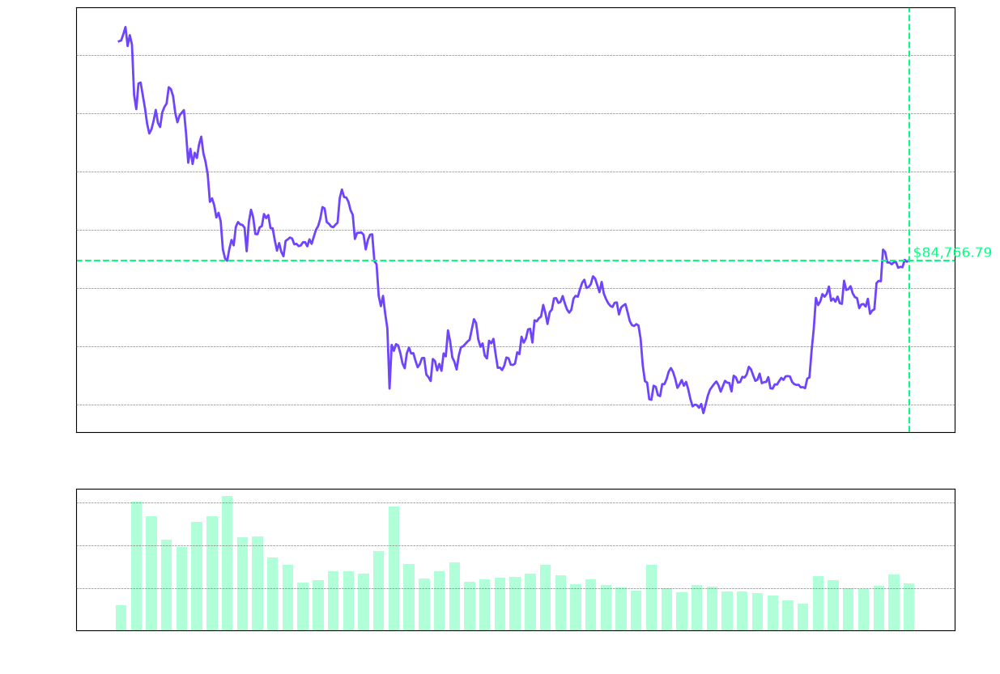

# Hi there, I'm [Zettalynx](https://github.com/Zettalynx) 👋

Welcome to my GitHub profile! Here you'll find various interactive elements and visualizations of Crypto price.

### Bitcoin Price (Last 1 Year)

### Coins

<!--START_SECTION:coins-->

<table style="width: 100%; border-collapse: collapse; color: white;">
  <tr>
    <th style="border: 1px solid white; padding: 10px;">#</th>
    <th style="border: 1px solid white; padding: 10px;">Coin</th>
    <th style="border: 1px solid white; padding: 10px;">Current Price (USD)</th>
    <th style="border: 1px solid white; padding: 10px;">Market Cap (USD)</th>
    <th style="border: 1px solid white; padding: 10px;">24h Volume (USD)</th>
  </tr>
  <tr>
    <td style="border: 1px solid white; padding: 10px;">1</td>
    <td style="border: 1px solid white; padding: 10px;"> Bitcoin (BTC)</td>
    <td style="border: 1px solid white; padding: 10px;">$81,671.00</td>
    <td style="border: 1px solid white; padding: 10px;">$1,641,241,103,990.00</td>
    <td style="border: 1px solid white; padding: 10px;">$42,600,236,986.00</td>
  </tr>
  <tr>
    <td style="border: 1px solid white; padding: 10px;">2</td>
    <td style="border: 1px solid white; padding: 10px;"> Ethereum (ETH)</td>
    <td style="border: 1px solid white; padding: 10px;">$2,474.10</td>
    <td style="border: 1px solid white; padding: 10px;">$302,130,227,643.00</td>
    <td style="border: 1px solid white; padding: 10px;">$19,017,724,179.00</td>
  </tr>
  <tr>
    <td style="border: 1px solid white; padding: 10px;">3</td>
    <td style="border: 1px solid white; padding: 10px;"> Tether (USDT)</td>
    <td style="border: 1px solid white; padding: 10px;">$1.00</td>
    <td style="border: 1px solid white; padding: 10px;">$183,956,753,771.00</td>
    <td style="border: 1px solid white; padding: 10px;">$80,448,596,546.00</td>
  </tr>
  <tr>
    <td style="border: 1px solid white; padding: 10px;">4</td>
    <td style="border: 1px solid white; padding: 10px;"> BNB (BNB)</td>
    <td style="border: 1px solid white; padding: 10px;">$734.12</td>
    <td style="border: 1px solid white; padding: 10px;">$97,759,240,984.00</td>
    <td style="border: 1px solid white; padding: 10px;">$1,236,143,858.00</td>
  </tr>
  <tr>
    <td style="border: 1px solid white; padding: 10px;">5</td>
    <td style="border: 1px solid white; padding: 10px;"> XRP (XRP)</td>
    <td style="border: 1px solid white; padding: 10px;">$1.39</td>
    <td style="border: 1px solid white; padding: 10px;">$87,492,653,495.00</td>
    <td style="border: 1px solid white; padding: 10px;">$3,349,311,560.00</td>
  </tr>
  <tr>
    <td style="border: 1px solid white; padding: 10px;">6</td>
    <td style="border: 1px solid white; padding: 10px;"> USDC (USDC)</td>
    <td style="border: 1px solid white; padding: 10px;">$1.00</td>
    <td style="border: 1px solid white; padding: 10px;">$73,130,838,636.00</td>
    <td style="border: 1px solid white; padding: 10px;">$25,390,077,530.00</td>
  </tr>
  <tr>
    <td style="border: 1px solid white; padding: 10px;">7</td>
    <td style="border: 1px solid white; padding: 10px;"> Solana (SOL)</td>
    <td style="border: 1px solid white; padding: 10px;">$108.96</td>
    <td style="border: 1px solid white; padding: 10px;">$64,157,652,693.00</td>
    <td style="border: 1px solid white; padding: 10px;">$4,990,269,578.00</td>
  </tr>
  <tr>
    <td style="border: 1px solid white; padding: 10px;">8</td>
    <td style="border: 1px solid white; padding: 10px;"> TRON (TRX)</td>
    <td style="border: 1px solid white; padding: 10px;">$0.33</td>
    <td style="border: 1px solid white; padding: 10px;">$31,576,993,193.00</td>
    <td style="border: 1px solid white; padding: 10px;">$384,927,805.00</td>
  </tr>
  <tr>
    <td style="border: 1px solid white; padding: 10px;">9</td>
    <td style="border: 1px solid white; padding: 10px;"> Figure Heloc (FIGR_HELOC)</td>
    <td style="border: 1px solid white; padding: 10px;">$1.03</td>
    <td style="border: 1px solid white; padding: 10px;">$24,390,382,737.00</td>
    <td style="border: 1px solid white; padding: 10px;">$28,009,580.00</td>
  </tr>
  <tr>
    <td style="border: 1px solid white; padding: 10px;">10</td>
    <td style="border: 1px solid white; padding: 10px;"> Zcash (ZEC)</td>
    <td style="border: 1px solid white; padding: 10px;">$1,185.65</td>
    <td style="border: 1px solid white; padding: 10px;">$20,128,512,196.00</td>
    <td style="border: 1px solid white; padding: 10px;">$1,522,511,669.00</td>
  </tr>
</table>

<!--END_SECTION:coins-->

<!--
**Zettalynx/Zettalynx** is a ✨ _special_ ✨ repository because its `README.md` (this file) appears on your GitHub profile.

Here are some ideas to get you started:

- 🔭 I’m currently working on ...
- 🌱 I’m currently learning ...
- 👯 I’m looking to collaborate on ...
- 🤔 I’m looking for help with ...
- 💬 Ask me about ...
- 📫 How to reach me: ...
- 😄 Pronouns: ...
- ⚡ Fun fact: ...
-->
