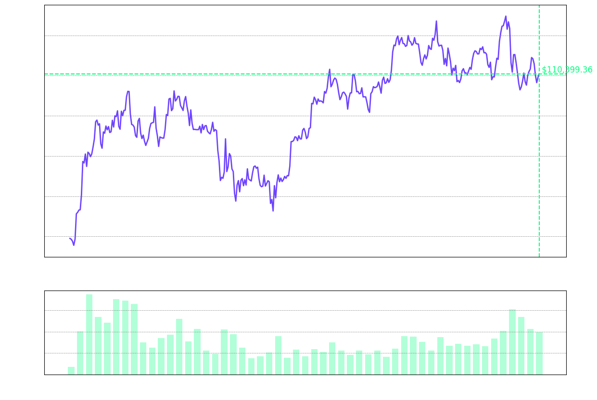

# Hi there, I'm [Zettalynx](https://github.com/Zettalynx) 👋

Welcome to my GitHub profile! Here you'll find various interactive elements and visualizations of Crypto price.

### Bitcoin Price (Last 1 Year)

### Coins

<!--START_SECTION:coins-->

<table style="width: 100%; border-collapse: collapse; color: white;">
  <tr>
    <th style="border: 1px solid white; padding: 10px;">#</th>
    <th style="border: 1px solid white; padding: 10px;">Coin</th>
    <th style="border: 1px solid white; padding: 10px;">Current Price (USD)</th>
    <th style="border: 1px solid white; padding: 10px;">Market Cap (USD)</th>
    <th style="border: 1px solid white; padding: 10px;">24h Volume (USD)</th>
  </tr>
  <tr>
    <td style="border: 1px solid white; padding: 10px;">1</td>
    <td style="border: 1px solid white; padding: 10px;"> Bitcoin (BTC)</td>
    <td style="border: 1px solid white; padding: 10px;">$103,677.00</td>
    <td style="border: 1px solid white; padding: 10px;">$2,059,607,473,813.00</td>
    <td style="border: 1px solid white; padding: 10px;">$27,106,317,867.00</td>
  </tr>
  <tr>
    <td style="border: 1px solid white; padding: 10px;">2</td>
    <td style="border: 1px solid white; padding: 10px;"> Ethereum (ETH)</td>
    <td style="border: 1px solid white; padding: 10px;">$2,575.52</td>
    <td style="border: 1px solid white; padding: 10px;">$310,988,255,515.00</td>
    <td style="border: 1px solid white; padding: 10px;">$21,014,913,793.00</td>
  </tr>
  <tr>
    <td style="border: 1px solid white; padding: 10px;">3</td>
    <td style="border: 1px solid white; padding: 10px;"> Tether (USDT)</td>
    <td style="border: 1px solid white; padding: 10px;">$1.00</td>
    <td style="border: 1px solid white; padding: 10px;">$151,084,521,828.00</td>
    <td style="border: 1px solid white; padding: 10px;">$58,193,496,634.00</td>
  </tr>
  <tr>
    <td style="border: 1px solid white; padding: 10px;">4</td>
    <td style="border: 1px solid white; padding: 10px;"> XRP (XRP)</td>
    <td style="border: 1px solid white; padding: 10px;">$2.40</td>
    <td style="border: 1px solid white; padding: 10px;">$140,784,188,292.00</td>
    <td style="border: 1px solid white; padding: 10px;">$3,614,649,212.00</td>
  </tr>
  <tr>
    <td style="border: 1px solid white; padding: 10px;">5</td>
    <td style="border: 1px solid white; padding: 10px;"> BNB (BNB)</td>
    <td style="border: 1px solid white; padding: 10px;">$648.48</td>
    <td style="border: 1px solid white; padding: 10px;">$94,606,203,981.00</td>
    <td style="border: 1px solid white; padding: 10px;">$937,805,544.00</td>
  </tr>
  <tr>
    <td style="border: 1px solid white; padding: 10px;">6</td>
    <td style="border: 1px solid white; padding: 10px;"> Solana (SOL)</td>
    <td style="border: 1px solid white; padding: 10px;">$169.76</td>
    <td style="border: 1px solid white; padding: 10px;">$88,246,274,395.00</td>
    <td style="border: 1px solid white; padding: 10px;">$4,298,888,624.00</td>
  </tr>
  <tr>
    <td style="border: 1px solid white; padding: 10px;">7</td>
    <td style="border: 1px solid white; padding: 10px;"> USDC (USDC)</td>
    <td style="border: 1px solid white; padding: 10px;">$1.00</td>
    <td style="border: 1px solid white; padding: 10px;">$60,805,113,700.00</td>
    <td style="border: 1px solid white; padding: 10px;">$9,009,278,743.00</td>
  </tr>
  <tr>
    <td style="border: 1px solid white; padding: 10px;">8</td>
    <td style="border: 1px solid white; padding: 10px;"> Dogecoin (DOGE)</td>
    <td style="border: 1px solid white; padding: 10px;">$0.22</td>
    <td style="border: 1px solid white; padding: 10px;">$33,541,210,592.00</td>
    <td style="border: 1px solid white; padding: 10px;">$2,084,579,137.00</td>
  </tr>
  <tr>
    <td style="border: 1px solid white; padding: 10px;">9</td>
    <td style="border: 1px solid white; padding: 10px;"> Cardano (ADA)</td>
    <td style="border: 1px solid white; padding: 10px;">$0.77</td>
    <td style="border: 1px solid white; padding: 10px;">$27,656,590,086.00</td>
    <td style="border: 1px solid white; padding: 10px;">$779,395,859.00</td>
  </tr>
  <tr>
    <td style="border: 1px solid white; padding: 10px;">10</td>
    <td style="border: 1px solid white; padding: 10px;"> TRON (TRX)</td>
    <td style="border: 1px solid white; padding: 10px;">$0.27</td>
    <td style="border: 1px solid white; padding: 10px;">$25,955,009,288.00</td>
    <td style="border: 1px solid white; padding: 10px;">$913,806,099.00</td>
  </tr>
</table>

<!--END_SECTION:coins-->

<!--
**Zettalynx/Zettalynx** is a ✨ _special_ ✨ repository because its `README.md` (this file) appears on your GitHub profile.

Here are some ideas to get you started:

- 🔭 I’m currently working on ...
- 🌱 I’m currently learning ...
- 👯 I’m looking to collaborate on ...
- 🤔 I’m looking for help with ...
- 💬 Ask me about ...
- 📫 How to reach me: ...
- 😄 Pronouns: ...
- ⚡ Fun fact: ...
-->
